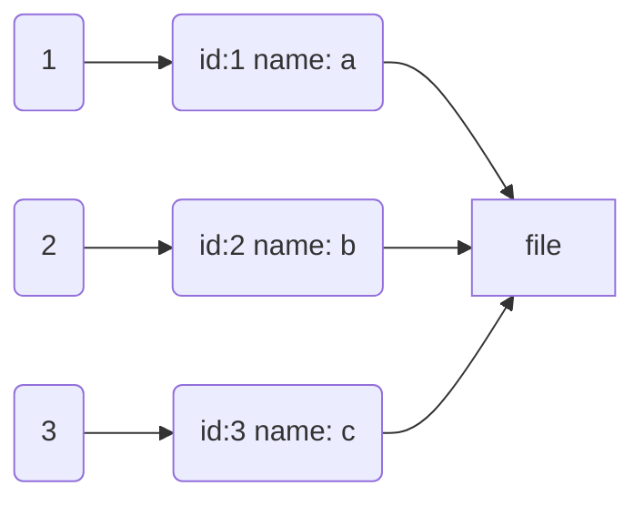

## 索引

> 提高数据查询的效率

数据存储在磁盘上面，需要索引按某个key（搜索码）记录数据存储的位置，提高查询效率。

### 索引常见模型

有两种基本的索引类型：

* 顺序索引

  基于值的顺序排序。

* 散列索引（hash）

  基于将值平均分布到若干散列桶中。一个值所属的散列桶是由一个函数决定的，该函数称为散列函数（hash function）

### 指标

* 查询类型

  能有效支持的访问类型。访问类型可以包括找到具体特定属性值的记录，以及找到属性值落在某个特定范围内的记录。

* 查询时间

  查询一个特定数据项或数据项集所需的时间。

* 写入时间

  插入一个新数据项所需的时间。该值包括找到待删除项所需的时间，以及更新索引结构所需的时间。

* 删除时间

  删除一个数据项所需的时间。该值包括找到待删除项所需的时间，以及更新索引结构所需的时间。

* 空间开销

  索引结构所占用的额外存储空间。倘若存储索引结构的额外空间大小适度，通常牺牲一定的空间代价来换取性能的提高是值得的。

### 顺序索引

为了快速随机访问文件中的记录，可以使用索引结构。每个索引结构与一个特定的搜索码相关联。顺序索引按顺序存储搜索码的值，并将每个搜索码与包含该搜索码的记录关联起来。

文件中的记录自身也可以按照某种排序顺序存储。一个文件可以有多个索引，分别基于不同的搜索码。

* 聚簇索引（clustering index）(primary index)

  如果文件按照某个搜索码指定的顺序排序，那么该搜索码对应的索引称为聚簇索引。聚簇索引也称为主索引。

* 非聚簇索引(non-clustering index)（二级索引）（secondary index）

  搜索码指定的顺序与文件中记录的物理顺序不同的索引称为非聚簇索引。也称为辅助索引。

* 索引顺序文件

  按照聚簇索引顺序排列的文件称为索引顺序文件。

### B+树索引文件
// TODO

### 哈希表

//TODO

### 有序数组
//TODO
### 搜索树
//TODO
