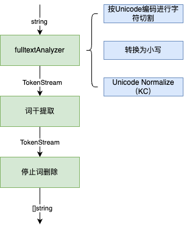
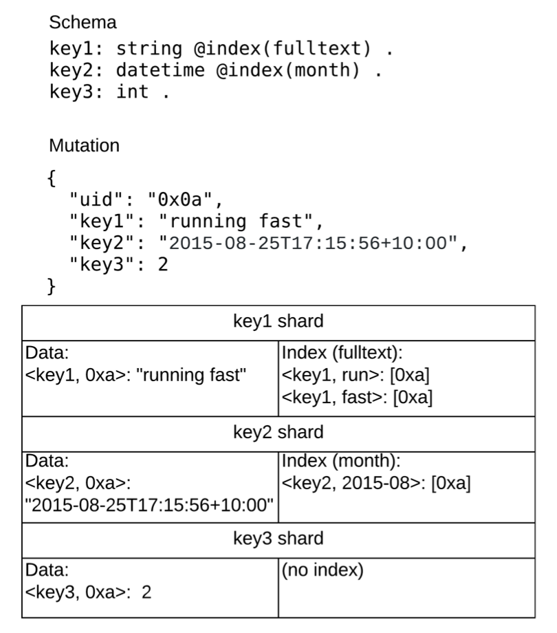

# 使用

语法：`alloftext(predicate, "space-separated text")` and `anyoftext(predicate, "space-separated text")`

`alloftext` 只有包含所有`token`的节点会被返回（取交集 Intersect）。

`anyoftext` 返回包含任意`token`的节点。

应用带有词干和停用词的全文搜索来查找与所有或任何给定文本匹配的字符串。

# 实现

DGraph 使用 [bleve](https://github.com/blevesearch/bleve) 进行全文搜索索引。

## Tokenizer

分词部分的代码在`tok`包。

核心的接口：`Tokenizer`

```go
// Tokenizer defines what a tokenizer must provide.
type Tokenizer interface {

	// 分词器的名称.不允许重复.
	Name() string

	// Type returns the string representation of the typeID that we care about.
	Type() string

	// Tokens return tokens for a given value. The tokens shouldn't be encoded
	// with the byte identifier.
	Tokens(interface{}) ([]string, error)

	// Identifier returns the prefix byte for this token type. This should be
	// unique. The range 0x80 to 0xff (inclusive) is reserved for user-provided
	// custom tokenizers.
	Identifier() byte

	// IsSortable returns true if the tokenizer can be used for sorting/ordering.
	IsSortable() bool

	// IsLossy returns true if we don't store the values directly as index keys
	// during tokenization. If a predicate is tokenized using an IsLossy() tokenizer,
	// then we need to fetch the actual value and compare.
	IsLossy() bool
}
```

## FullTextTokenizer

`FullTextTokenizer` 类实现了全文检索的分词器。

```go
type FullTextTokenizer struct{ 
  lang string 
}
```

FullTextTokenizer 采用`cjk-bigram` 对中文`TokenStream`进行词干提取。

* `cjk-bigram`

  `cjk-bigram`是一种用于处理中文、日文和韩文（CJK即Chinese, Japanese, Korean的缩写）文本的方法，尤其在信息检索和文本分析中应用广泛。尽管称其为“stemmers filter”可能有些误导，因为它并不直接涉及到传统意义上的“词干提取”（stemming），而更多是关于文本的分词和索引优化。

  1. **Bigram 分词**：
     - 在处理中文时，`cjk-bigram`方法主要采用bigram（二元组）方式来分析文本。Bigram是指连续的两个字符或两个词的组合。例如，对于句子“我们学习”，bigram分割将产生“我们”和“学习”（如果按词分割），或“我 们”、“们 学”、“学 习”（如果按字符分割）。
  2. **索引构建**：
     - 在信息检索系统中，使用bigram分割可以帮助构建更为细致的索引，使得搜索引擎可以在没有明确分词界限的情况下，更有效地匹配文本。这种方法特别适用于中文这样的语言，因为中文没有明显的单词界限（如空格分隔）。
  3. **提高匹配灵活性**：
     - 使用bigram可以增加文本匹配的灵活性。例如，搜索“学习”时，即使文本中没有精确的“学习”词汇，但只要有连续的“学”和“习”出现，系统也可能将其视为相关文本。
  4. **处理效率**：
     - Bigram方法虽然可以增加处理的复杂度（因为生成的索引更大），但它提供了一种相对简单直接的方式来处理中文文本，特别是在缺乏精确分词工具的情况下。

总体流程：



核心代码：

```go
const unicodenormName = "unicodenorm_nfkc"

func setupBleve{
  ...
  // fulltext analyzer - does language stop-words removal and stemming.
	fulltextAnalyzer, err = bleveCache.DefineAnalyzer("fulltext",
		map[string]interface{}{
			"type":      custom.Name,
			"tokenizer": unicode.Name, // splits on word boundaries.
			"token_filters": []string{
				lowercase.Name, // lowercase
        unicodenormName, // normalize tokens by unicodenorm_nfkc.
			},
		})
  ...
}


func (t FullTextTokenizer) Tokens(v interface{}) ([]string, error) {
	str, ok := v.(string)
	if !ok || str == "" {
		return []string{}, nil
	}
	lang := LangBase(t.lang)
  // pass 1 - lowercase and normalize input 转换为小写并且使用Unicode 标准来分割文本.
	tokens := fulltextAnalyzer.Analyze([]byte(str))
	// pass 2 - filter stop words
	tokens = filterStopwords(lang, tokens)
	// pass 3 - filter stems
	tokens = filterStemmers(lang, tokens) 
	// finally, return the terms.
	return uniqueTerms(tokens), nil
}
```

`fulltextAnalyzer`代表一个bleve里面的分析器，它的功能为将字符串转换为小写并且使用Unicode 标准来分割文本。

`filterStemmers(lang, tokens)` 内部通过语言和`filter`类型的映射选择语言对应的`filter`进行词干分析。

# 索引的存储

`DGraph` 索引的存储结构与值一致，都是通过`PostingList` 数据结构存储。区别是key不同，数据的key为<predicate, uid>, 而索引的key为<predicate, token>。Token 即上文中介绍的通过分词器 Tokenizer处理谓词值生成的。

``` protobuf
message PostingList {
	UidPack pack = 1;
	repeated Posting postings = 2;
	int64 commit_ts = 3;
	repeated uint64 splits = 4;
}
```

例子：




以NQuad: <0xa>  <key1> "running fast" . 为例，`key1`的`schema`类型为 `fulltext`，通过`fulltext` 分词器处理后，会生成两个`token`：

"run", "fast"。

根据这两个`token`，`dgraph`将其组织为两条边(`DirectedEdge`)：

* <key, run> -> [0xa]

* <key, fast> -> [0xa]

这样，值"run fast" 的索引就转换为后端存储的KVs。
